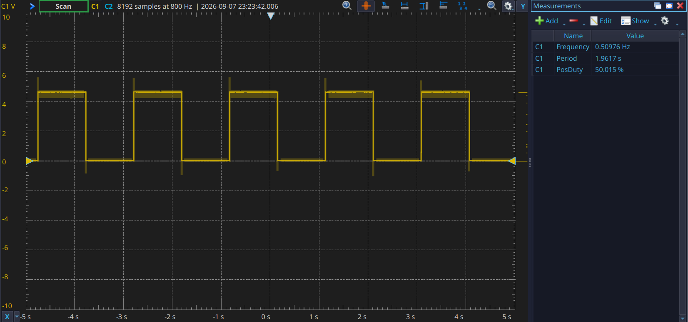
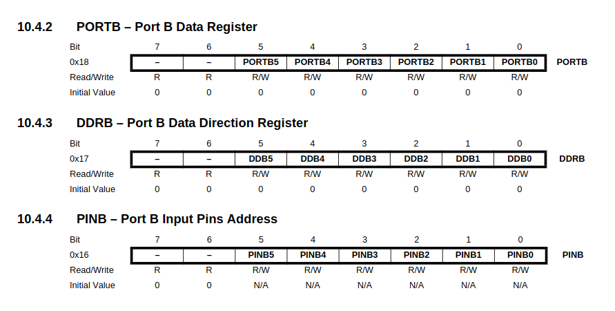
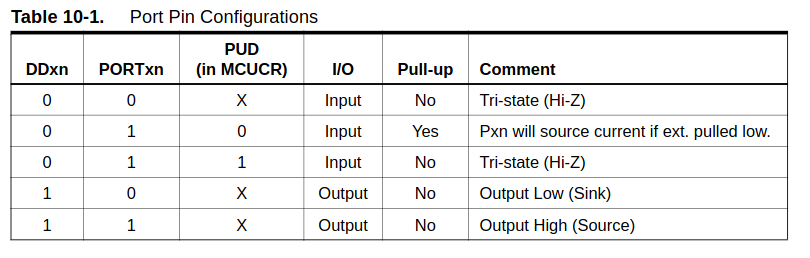

# 02 - Busy Loop Blink

This project takes the busy loop delay code from the previous
project and adds some GPIO code to make an LED blink. I've also
checked the output frequency to confirm it is roughly 0.5Hz,
matching the expected 1 second on, 1 second off behavior.

## GPIO configuration reference:

