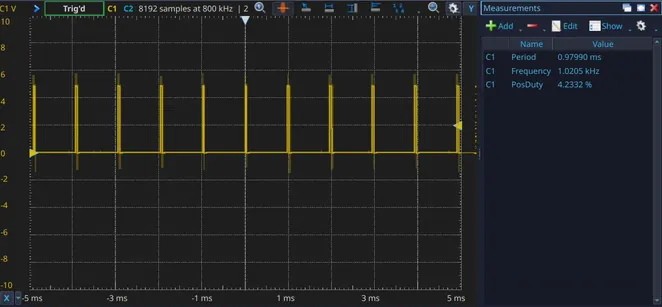
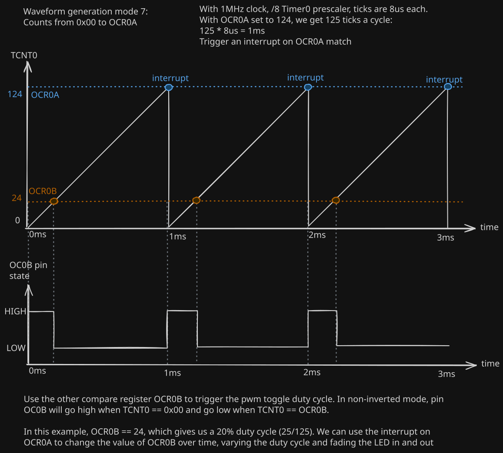

# 07 - PWM Fade

In this project, I want to fade an LED in and out using PWM. I want the
LED to linearly ramp from 0% duty cycle (off) to 100% duty cycle (on) 
over 1 second, and then back from 100% to 0% over the next second, 
repeating indefinitely.

